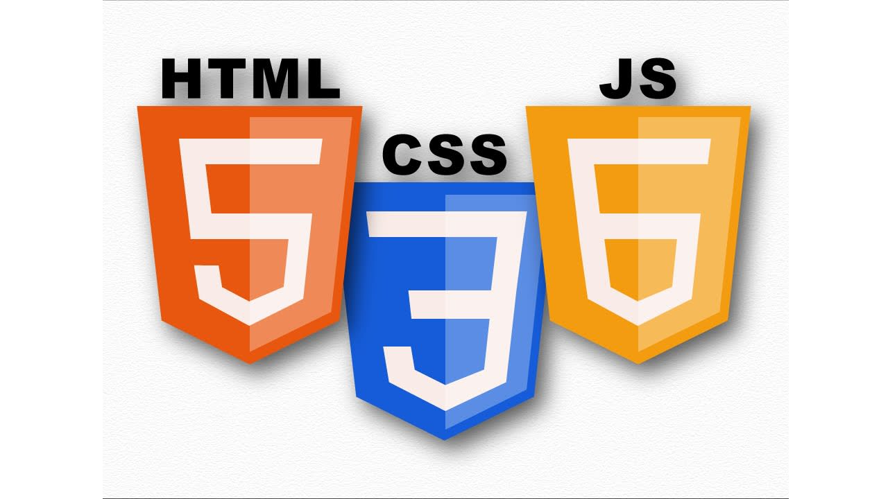

<h1><b>Astroid Juggler</b></h1>

## Designer: Sam'an Griffiths
### Date: 8/15/2021

### Introduction:
Welcome to my world! Literally. This game is a, mini, interactive universe, specifically designed for your enjoyment! 

img src
https://wingsoffire.fandom.com/wiki/User_blog:ArtyBasketballer/Testing_Some_Coding...

Ball physics
https://www.youtube.com/playlist?list=PLo6lBZn6hgca1T7cNZXpiq4q395ljbEI_
 
Basic Outline
https://developer.mozilla.org/en-US/docs/Games/Tutorials/2D_Breakout_game_pure_JavaScript