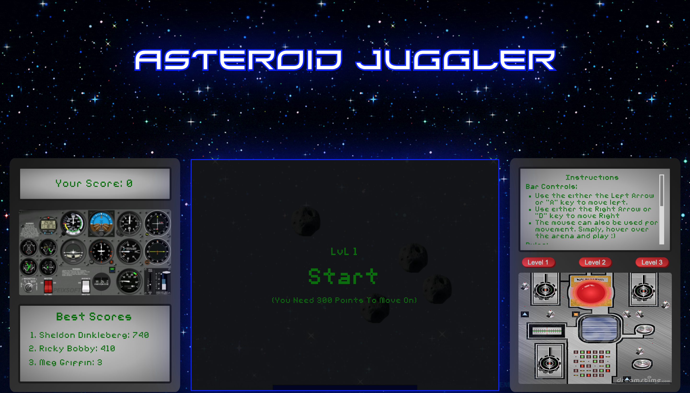

	

	<h1><b>Astroid Juggler</b></h1>

	<h3>Designed and executed by Sam'an Griffiths</h3>

### :handshake: Introduction
Welcome to my world, literally! This game is a, mini, interactive universe, specifically designed for your enjoyment! I created this project with a three piece as classic as the lemon pepper combo  from Harold's Chicken in my hometown of Chicago, the front end stack HTML, CSS, & Vanilla JavaScript. As you may have gathered, gameplay is heavily collision-based, thus physics, and some of the trigonometry behind it, are integral parts of the logic engine driving this game. The object of which, in layman's terms, is to keep the asteroids off of the ground. Simple, you say? I bet one round of gameplay and a peek at the code behind it will change your mind!

	

img src
https://wingsoffire.fandom.com/wiki/User_blog:ArtyBasketballer/Testing_Some_Coding...

Ball physics
https://www.youtube.com/playlist?list=PLo6lBZn6hgca1T7cNZXpiq4q395ljbEI_
 
Basic Outline
https://developer.mozilla.org/en-US/docs/Games/Tutorials/2D_Breakout_game_pure_JavaScript
