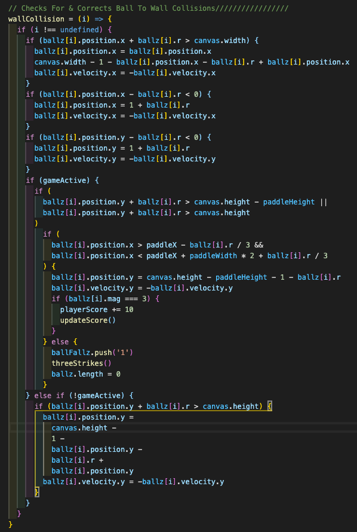

	

<h1><b>Astroid Juggler</b> </h1>
<h3>Designed and Executed by Sam'an Khaliq   :triangular_ruler: :memo: :computer: :hourglass_flowing_sand:</h3>
<a href='https://www.linkedin.com/in/saman-khaliq/' target="_blank">Connect On LinkedIn</a> | <a href='https://asteroid-juggler.surge.sh/' target="_blank">Play The Game :joystick:</a> | <a href='https://www.samankhaliq.com/' target="_blank">Check Out My Portfolio :scroll:</a>

---

<h3>:handshake: Overview :handshake:</h3>

Welcome to my world, literally! This game is a mini, interactive universe, specifically designed for your enjoyment! I created this project with a three-piece as classic as Harold's Chicken's, the front end stack HTML, CSS, & Vanilla JavaScript. Asteroid Juggler is my second venture into game logic and, by far, my favorite. Now I must say, I was advised by my Instructor that I shouldn't try to learn how to use HTML canvas, we had only just started to learn how to use javascript in collaboration with HTML. We only had one week to complete and hand in the project... I took this advice as a challenge. I'm proud to say that I successfully learned how to use canvas and create sprites to animate movement in time to successfully turn in the project! This had been the hardest coding skill I'd ever taught myself up to that point. Keep in mind that it had been less than a month since I had even started to learn how to write code. Of course, none of that would matter if the game wasn't interesting to look at and engaging to play. I'm so glad I took the time to research and learnthe CSS skills necessary to give this game a glossy finish! The object of which, in layman's terms, is to keep the asteroids off of the ground. Simple, you say? I bet one round of gameplay and a peek at the code behind it will change your mind!:smiling_imp:

***

### :smiling_face_with_three_hearts: Favorite Code Block :smiling_face_with_three_hearts:

As you may have gathered, the gameplay is heavily collision-based. Thus physics, and some of the trigonometry behind it, are integral parts of the logic engine driving this game. In this code block, I adapt the equations commonly used to describe simple physical collisions to ignore friction and give the asteroids (I call them balls in the code because the original concept was just a ball-bouncing game) perpetual motion. This was especially fun for me because physics is a topic I'm profusely passionate about, so I enjoyed delving back into the equations we use to understand the world around us!

<h3>:raised_hands: Honorable Mentions :raised_hands:</h3>

<a href="https://developer.mozilla.org/en-US/docs/Games/Tutorials/2D_Breakout_game_pure_JavaScript" target="_blank">Game Logic Basis</a> | <a href="https://www.youtube.com/playlist?list=PLo6lBZn6hgca1T7cNZXpiq4q395ljbEI_" target="_blank">Ball Physics Basis</a> | <a href="http://clipart-library.com/control-panel-cliparts.html" target="_blank">Control Panel</a> | <a href="http://nafcflying.org/documents.html" target="_blank">Flight Sim</a> | <a href="https://gifer.com/en/IrF" target="_blank">Background</a>
<h3> Thank You To Everyone Who Had A Hand In Creating This Content
! <h3>

